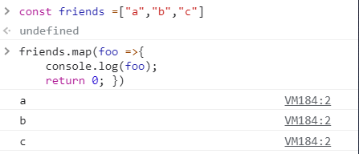

# 김호준 201740211

## [09월29일]
<br>

Prop-Types 도입
---
prop-Types을 도입하면 
<br>
>Picture Props에{dish.image}가 아닌{true}를 전달할경우 이를 검사해준다.
<br><br>

Prop-Types 다운
---
터미널에서  명령어 입력
```javascript
  npm install prop-types
```
prop-types등록하여 컴포넌트가 전달받은 props가 원하는 값인 확인해준다.
<br><br>

State 사용하기
---
>class를 `React.Component'로 상속받는다.
<br>
'React.Component'클래스는 500줄이 넘는 코드로 여러가지 구현을 가져와 사용할 수 있다.

<br>
class 형 컴포넌트에서 바로 return을 바로 사용할 수 없기에 render()함수 내에서 return문을 사용해준다.

```javascript
  import React,{Component} from 'react'
  
  class Appst extends Component{
      render(){
        return(
          <h1> Hello React <h1/>
        )
      }
  }
  export default Appst
```
출력 ->Hello React
 

## [09월15일]
<br>

Map 함수
----
>선언형 프로그래밍으로써 map 함수를 사용하여 받은 값을 하나하나 보여준다.
```javascript
  const friends = ["a","b","c"]
  
  friends.map(foo =>{
    console.log(foo);
    return 0;
  })

```
이결과 콘솔창에 map함수로 인하여 정렬되는것을 확인하실수있습니다.



이렇게 정렬되어 하나하나 보여준다.
<hr>

## 저번주 활용 - Potato.js 를 만들어 react 화면에 표출 

<br>
Potato.js 

```javascript
    function Potato(bar){
        return<h1>I love {bar.fav}</h1>
       }
        export default Potato;
```
App.js
```javascript
import Potato from "./Potato";

function App() {
  return (
    <Potato fav="potato"/>
  )

export default App;
```
Potato.js를 function을 App.js에 import 후 ```<Potato>```를 return하면 index.js에서 Potato.js의 값을 react화면에 보여준다

<br> 
 
 ## [09월08일]
 <br>
 
 React란?
---------
> React는 facebook에서 제공해주는 프론트엔드 라이브러리라고 볼 수 있습니다.
싱글 페이지 애플리케이션이나 모바일 애플리케이션의 개발 시 토대로 사용될 수 있습니다.

React특징
--------
>React의 특징은 크게 다음과 같이 구분해보았습니다.
>1. Data Flow
>2. Component 기반 구조
>3. Virtual Dom
>4. Props and State
>5. JSX

리액트 생성
----------

<u>
npx create-react-app 프로젝트 폴더명
</u>

리액트 서버 실행 
-------
<br>
npm start

App.js
-----

```javaScript

function App() {
  return (
    <div>
      Hello!! React
    </div>
  );
}


export default App;
```
### App 의 정보를  index.js로 보내준다.
Index.js
-------
```javaScript
import ReactDOM from 'react-dom';
import App from './App';


ReactDOM.render(

    <App/>,
  document.getElementById('root')
);

```
### index.js 에서 정보를 받고 그정보를 index.html 한테  보내주어서 화면으로 표출해준다.
index.html

``` html
<div id="root"></div>
```
